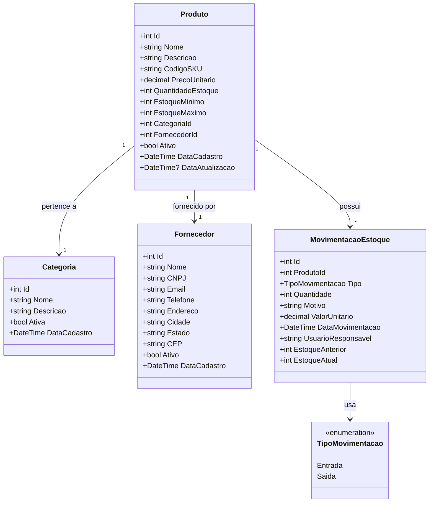
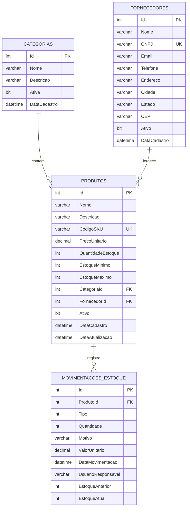

# Sistema de Controle de Estoque - Documentação Técnica

## 1. Visão Geral do Projeto

Sistema web para gerenciamento de estoque de produtos, permitindo controle de entradas, saídas, fornecedores e geração de relatórios. O projeto visa demonstrar competências em desenvolvimento de APIs RESTful, modelagem de banco de dados e arquitetura em camadas.

**Objetivo**: Fornecer uma solução simples e eficiente para controle de inventário de pequenas e médias empresas.

---

## 2. Requisitos Funcionais

### RF01 - Gestão de Produtos
- Cadastrar produtos com informações básicas (nome, descrição, código SKU, preço)
- Editar informações de produtos existentes
- Excluir produtos (soft delete - manter histórico)
- Listar produtos com filtros (nome, categoria, fornecedor)
- Visualizar detalhes de um produto específico
- Validar SKU único no sistema

### RF02 - Gestão de Categorias
- Cadastrar categorias de produtos
- Editar categorias existentes
- Excluir categorias (verificar se há produtos vinculados)
- Listar todas as categorias
- Associar produtos a categorias

### RF03 - Gestão de Fornecedores
- Cadastrar fornecedores (nome, CNPJ, contato, endereço)
- Editar informações de fornecedores
- Excluir fornecedores (verificar se há produtos vinculados)
- Listar fornecedores com paginação
- Validar CNPJ único no sistema

### RF04 - Controle de Movimentações de Estoque
- Registrar entrada de produtos (compra/devolução)
- Registrar saída de produtos (venda/perda)
- Informar quantidade, motivo e data da movimentação
- Atualizar automaticamente o estoque atual do produto
- Registrar usuário responsável pela movimentação

### RF05 - Alertas de Estoque
- Configurar estoque mínimo por produto
- Listar produtos abaixo do estoque mínimo
- Configurar estoque máximo (opcional)

### RF06 - Relatórios
- Relatório de produtos em estoque (quantidade, valor total)
- Histórico de movimentações por produto
- Produtos mais movimentados (entrada/saída) em período
- Valor total do estoque por categoria
- Exportação de relatórios em JSON/CSV

### RF07 - Busca e Filtros
- Buscar produtos por nome, SKU ou código de barras
- Filtrar por categoria
- Filtrar por fornecedor
- Filtrar por faixa de preço
- Ordenação por diferentes campos

---

## 3. Requisitos Não-Funcionais

### RNF01 - Tecnologia
- Backend: ASP.NET Core 8.0 ou superior
- ORM: Entity Framework Core
- Banco de Dados: SQL Server ou PostgreSQL
- Arquitetura: API RESTful

### RNF02 - Segurança
- Validação de dados de entrada
- Proteção contra SQL Injection (usar ORM adequadamente)
- Implementar CORS para controle de origem

### RNF03 - Performance
- Paginação obrigatória para listagens
- Índices em campos de busca frequente (SKU, nome, CNPJ)
- Lazy loading quando apropriado

### RNF04 - Qualidade de Código
- Separação em camadas (Controller, Service, Repository, Domain)
- Uso de DTOs para transferência de dados
- Tratamento centralizado de exceções
- Logging de operações críticas

### RNF05 - Documentação
- Documentação da API com Swagger/OpenAPI
- README com instruções de setup
- Comentários em lógicas complexas

### RNF06 - Versionamento
- Utilizar Git com commits semânticos
- Branches para features (Git Flow simplificado)

---

## 4. Diagrama de Classes



---

## 5. Diagrama de Banco de Dados (DER)



**Índices Sugeridos:**
- PRODUTOS: `IX_Produtos_CodigoSKU`, `IX_Produtos_Nome`, `IX_Produtos_CategoriaId`, `IX_Produtos_FornecedorId`
- FORNECEDORES: `IX_Fornecedores_CNPJ`
- MOVIMENTACOES_ESTOQUE: `IX_Movimentacoes_ProdutoId`, `IX_Movimentacoes_DataMovimentacao`

---

## 6. Arquitetura do Projeto

### Estrutura de Camadas

```
SistemaEstoque/
│
├── SistemaEstoque.API/                 # Camada de Apresentação
│   ├── Controllers/                    # Endpoints da API
│   ├── Middlewares/                    # Exception handling, logging
│   ├── Program.cs                      # Configuração da aplicação
│   └── appsettings.json                # Configurações
│
├── SistemaEstoque.Application/         # Camada de Aplicação
│   ├── DTOs/                           # Data Transfer Objects
│   │   ├── Request/                    # DTOs de entrada
│   │   └── Response/                   # DTOs de saída
│   ├── Interfaces/                     # Interfaces de serviços
│   ├── Services/                       # Lógica de negócio
│   ├── Validators/                     # Validações (FluentValidation)
│   └── Mappings/                       # AutoMapper profiles
│
├── SistemaEstoque.Domain/              # Camada de Domínio
│   ├── Entities/                       # Entidades do domínio
│   ├── Enums/                          # Enumerações
│   ├── Interfaces/                     # Interfaces de repositórios
│   └── Exceptions/                     # Exceções customizadas
│
├── SistemaEstoque.Infrastructure/      # Camada de Infraestrutura
│   ├── Data/                           # Contexto do EF Core
│   ├── Repositories/                   # Implementação dos repositórios
│   ├── Migrations/                     # Migrations do EF Core
│   └── Configuration/                  # Configurações de entidades (Fluent API)
│
└── SistemaEstoque.Tests/               # Testes (opcional nesta fase)
    ├── Unit/                           # Testes unitários
    └── Integration/                    # Testes de integração
```

### Fluxo de Requisição

```
Cliente HTTP Request
    ↓
Controller (API Layer)
    ↓
Service (Application Layer) ← usa DTOs
    ↓
Repository (Infrastructure Layer)
    ↓
Database
    ↓
Response (DTO) → Cliente
```

---

## 7. Casos de Uso Principais

### UC01 - Cadastrar Produto
**Ator**: Usuário do sistema  
**Pré-condições**: Categoria e Fornecedor já cadastrados  
**Fluxo Principal**:
1. Usuário envia dados do produto via API
2. Sistema valida dados obrigatórios (nome, SKU, preço, categoria, fornecedor)
3. Sistema verifica se SKU já existe
4. Sistema cria produto com estoque inicial zerado
5. Sistema retorna produto cadastrado

**Fluxos Alternativos**:
- 3a. SKU já existe → retorna erro 409 (Conflict)
- 2a. Dados inválidos → retorna erro 400 (Bad Request) com detalhes

### UC02 - Registrar Entrada de Estoque
**Ator**: Usuário do sistema  
**Pré-condições**: Produto cadastrado  
**Fluxo Principal**:
1. Usuário envia dados da movimentação (produto, quantidade, motivo)
2. Sistema valida dados obrigatórios
3. Sistema registra estoque anterior
4. Sistema incrementa quantidade em estoque do produto
5. Sistema cria registro de movimentação (tipo: Entrada)
6. Sistema registra estoque atual
7. Sistema retorna movimentação registrada

**Fluxos Alternativos**:
- 2a. Produto não encontrado → retorna erro 404 (Not Found)
- 2b. Quantidade inválida (≤0) → retorna erro 400 (Bad Request)

### UC03 - Registrar Saída de Estoque
**Ator**: Usuário do sistema  
**Pré-condições**: Produto cadastrado com estoque disponível  
**Fluxo Principal**:
1. Usuário envia dados da movimentação (produto, quantidade, motivo)
2. Sistema valida dados obrigatórios
3. Sistema verifica se há estoque suficiente
4. Sistema registra estoque anterior
5. Sistema decrementa quantidade em estoque do produto
6. Sistema cria registro de movimentação (tipo: Saída)
7. Sistema registra estoque atual
8. Sistema retorna movimentação registrada

**Fluxos Alternativos**:
- 3a. Estoque insuficiente → retorna erro 400 (Bad Request) informando estoque atual
- 2a. Produto não encontrado → retorna erro 404 (Not Found)

### UC04 - Listar Produtos Abaixo do Estoque Mínimo
**Ator**: Usuário do sistema  
**Fluxo Principal**:
1. Usuário solicita lista de produtos críticos
2. Sistema busca produtos onde QuantidadeEstoque < EstoqueMinimo
3. Sistema retorna lista com produto, estoque atual e estoque mínimo

### UC05 - Gerar Relatório de Movimentações
**Ator**: Usuário do sistema  
**Pré-condições**: Período de data informado  
**Fluxo Principal**:
1. Usuário informa filtros (produto, data início, data fim, tipo movimentação)
2. Sistema busca movimentações conforme filtros
3. Sistema agrupa e calcula totais
4. Sistema retorna relatório em formato JSON ou CSV

---

## 8. Endpoints da API (Sugestão)

### Produtos
- `GET /api/produtos` - Listar produtos (com paginação e filtros)
- `GET /api/produtos/{id}` - Buscar produto por ID
- `POST /api/produtos` - Cadastrar produto
- `PUT /api/produtos/{id}` - Atualizar produto
- `DELETE /api/produtos/{id}` - Excluir produto (soft delete)
- `GET /api/produtos/estoque-baixo` - Produtos abaixo do estoque mínimo

### Categorias
- `GET /api/categorias` - Listar categorias
- `GET /api/categorias/{id}` - Buscar categoria por ID
- `POST /api/categorias` - Cadastrar categoria
- `PUT /api/categorias/{id}` - Atualizar categoria
- `DELETE /api/categorias/{id}` - Excluir categoria

### Fornecedores
- `GET /api/fornecedores` - Listar fornecedores
- `GET /api/fornecedores/{id}` - Buscar fornecedor por ID
- `POST /api/fornecedores` - Cadastrar fornecedor
- `PUT /api/fornecedores/{id}` - Atualizar fornecedor
- `DELETE /api/fornecedores/{id}` - Excluir fornecedor

### Movimentações
- `GET /api/movimentacoes` - Listar movimentações (com filtros)
- `GET /api/movimentacoes/{id}` - Buscar movimentação por ID
- `POST /api/movimentacoes/entrada` - Registrar entrada
- `POST /api/movimentacoes/saida` - Registrar saída
- `GET /api/movimentacoes/produto/{produtoId}` - Histórico de um produto

### Relatórios
- `GET /api/relatorios/estoque-atual` - Estoque atual consolidado
- `GET /api/relatorios/valor-estoque` - Valor total em estoque
- `GET /api/relatorios/movimentacoes` - Relatório de movimentações por período

---

## 9. Tecnologias Sugeridas

### Essenciais
- **.NET 8.0** (LTS)
- **ASP.NET Core Web API**
- **Entity Framework Core** (com Migrations)
- **SQL Server Express** ou **PostgreSQL**

### Bibliotecas Recomendadas
- **AutoMapper** - Mapeamento entre entidades e DTOs
- **FluentValidation** - Validação de dados
- **Swashbuckle (Swagger)** - Documentação da API
- **Serilog** - Logging estruturado
- **Bogus** (opcional) - Geração de dados fake para testes

### Ferramentas de Desenvolvimento
- **Visual Studio 2022** ou **VS Code + C# Dev Kit**
- **Postman** ou **Insomnia** - Testes de API
- **SQL Server Management Studio** ou **Azure Data Studio**
- **Git** + **GitHub**

---

## 10. Regras de Negócio Importantes

### RN01 - Estoque Não Pode Ser Negativo
- Ao registrar saída, validar se quantidade solicitada ≤ estoque atual
- Se insuficiente, retornar erro com estoque disponível

### RN02 - SKU Único
- Não permitir cadastro de produtos com SKU duplicado
- Validar na camada de Application antes de persistir

### RN03 - CNPJ Único para Fornecedores
- Não permitir dois fornecedores com mesmo CNPJ
- Implementar validação de formato de CNPJ

### RN04 - Soft Delete
- Ao excluir produto/fornecedor/categoria, apenas marcar como inativo
- Manter histórico de movimentações mesmo de produtos inativos

### RN05 - Integridade Referencial
- Não permitir exclusão de categoria com produtos vinculados
- Não permitir exclusão de fornecedor com produtos vinculados
- Validar na camada de Service antes de chamar Repository

### RN06 - Rastreamento de Movimentações
- Toda alteração de estoque deve gerar registro em MovimentacaoEstoque
- Registrar estoque anterior e atual para auditoria

### RN07 - Validação de Preços
- Preço unitário deve ser maior que zero
- Valor da movimentação calculado automaticamente (quantidade × preço)

---

## 11. Considerações de Implementação

### Paginação
Implementar paginação em todas as listagens:
- Parâmetros: `pageNumber` (padrão: 1) e `pageSize` (padrão: 10, máximo: 100)
- Retornar metadados: total de itens, total de páginas, página atual

### Tratamento de Erros
Criar middleware global para capturar exceções:
- Exceções de domínio → 400 (Bad Request)
- Entidade não encontrada → 404 (Not Found)
- Violação de regra única → 409 (Conflict)
- Erros não tratados → 500 (Internal Server Error)

### DTOs vs Entidades
- Nunca expor entidades diretamente nos controllers
- Criar DTOs específicos para Request e Response
- Usar AutoMapper para conversões

### Validações
- Validações simples (obrigatório, tamanho) → Data Annotations ou FluentValidation
- Validações complexas (regras de negócio) → Services
- Validações de infraestrutura (CNPJ, e-mail) → Validators customizados

---

## 12. Próximos Passos (Após Implementação Básica)

### Melhorias Futuras
1. **Autenticação e Autorização** (JWT)
2. **Controle de Lotes** (rastreamento por lote de produtos)
3. **Código de Barras** (geração e leitura)
4. **Dashboard** (frontend simples com gráficos)
5. **Notificações** (e-mail quando estoque crítico)
6. **Importação/Exportação** (Excel, CSV)
7. **Multi-tenancy** (múltiplas empresas no mesmo sistema)
8. **Auditoria** (quem/quando fez cada alteração)

---

## 13. Checklist de Desenvolvimento

### Setup Inicial
- [ ] Criar repositório no GitHub
- [ ] Configurar .gitignore para .NET
- [ ] Criar estrutura de pastas (camadas)
- [ ] Configurar connection string
- [ ] Instalar pacotes NuGet necessários

### Camada de Domínio
- [ ] Criar entidades (Produto, Categoria, Fornecedor, MovimentacaoEstoque)
- [ ] Criar enums (TipoMovimentacao)
- [ ] Criar interfaces de repositórios
- [ ] Criar exceções customizadas

### Camada de Infraestrutura
- [ ] Configurar DbContext
- [ ] Configurar Fluent API para entidades
- [ ] Implementar repositórios
- [ ] Criar migration inicial
- [ ] Aplicar migration no banco

### Camada de Aplicação
- [ ] Criar DTOs de Request e Response
- [ ] Configurar AutoMapper
- [ ] Implementar validators (FluentValidation)
- [ ] Implementar Services

### Camada de API
- [ ] Criar Controllers
- [ ] Configurar Swagger
- [ ] Implementar middleware de erros
- [ ] Configurar CORS
- [ ] Configurar logging

### Testes
- [ ] Testar todos os endpoints no Postman/Insomnia
- [ ] Validar regras de negócio
- [ ] Testar cenários de erro
- [ ] Verificar validações

### Documentação
- [ ] Completar README com instruções de setup
- [ ] Documentar endpoints no Swagger
- [ ] Adicionar exemplos de uso
- [ ] Commitar e subir para GitHub

---

## 14. Dicas de Desenvolvimento

1. **Comece pelo Domínio**: Defina bem suas entidades antes de pensar em controllers
2. **Use Migrations**: Sempre use migrations para alterar o banco, nunca manualmente
3. **DTOs sempre**: Separe o que entra/sai da API do modelo de domínio
4. **Valide cedo**: Quanto mais cedo você validar dados, melhor
5. **Teste conforme desenvolve**: Não deixe para testar tudo no final
6. **Commits pequenos e frequentes**: Um commit por feature/correção
7. **README atualizado**: Documente setup, endpoints e decisões técnicas

---

**Boa sorte no desenvolvimento! Quando tiver dúvidas ou precisar discutir arquitetura/design, é só chamar.**
